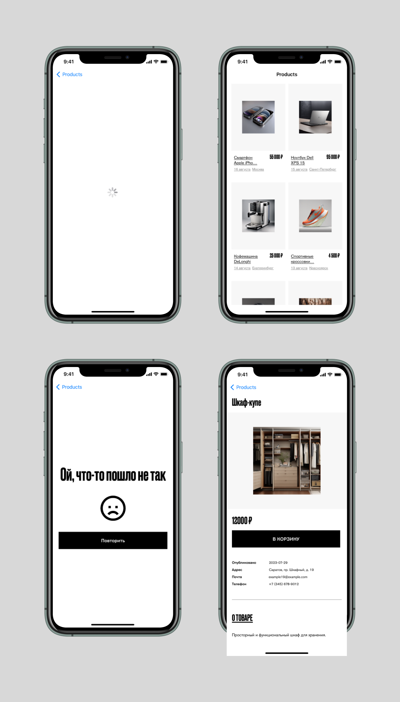

# MarketplaceApp

Тестовое задания для стажировки в Avito. 
Сделано в полном соотвествии с требованиями, указанными в ТЗ. 

Для работы с данными использовалось API от Avito:\
 > https://www.avito.st/s/interns-ios/main-page.json 
 >   URL для запроса на главном экране.
 > https://www.avito.st/s/interns-ios/details/{itemId}.json
 >  URL для запроса на детальной странице. ID берется из данных для главного экрана.
 >  Пример ссылки: https://www.avito.st/s/interns-ios/details/1.json"

# Overview

- Написано на Swift
- Спроектировано с использованием MVVM архитектуры.
- Не требует дополнительных зависимостей
- Для API запросов использовался URLSession
- UI верстка полностью кодом (programmatically), autolayout based

  
  **Также из достоинств:**\

- Приятный, простой и стильный дизайн ^-^
- Есть красивая анимация нажатия на ячейки collectionview
- NSCache для изображений 

# Скриншоты 





# Как установить
Очень просто!

1) Клонируйте репозиторий

```bash
$ https://github.com/ilyaberous/MarketplaceApp.git
```

2) Откройте .xcodeproj файл в Xcode

```bash
$ open "MarketplaceApp.xcodeproj"
```

3) Скомпилируйте и запустите приложение

4) Готово!

> Если будут какие-либо проблемы с установкой, сообщите мне, пожалуйста.


